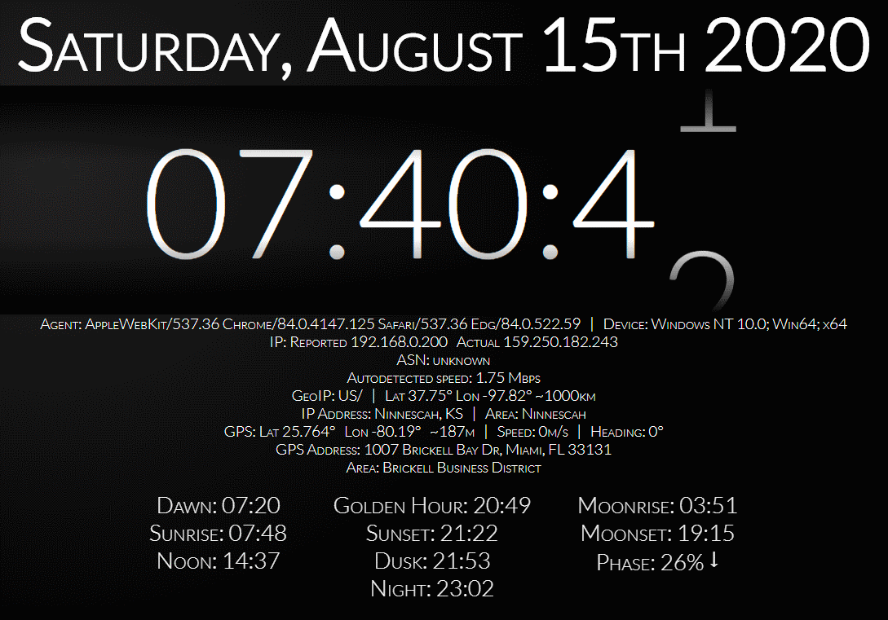

# PiClock

**Just a clock . . .**

Plus a little bit of GPS lookups, GeoIP lookups, GeoDecoding, Agent analysis, Astronomy calculations, etc...

Written in NodeJS using pure ES7 without client or server frameworks

